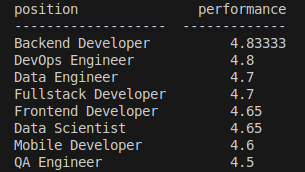

# workmate_test

Скрипт читает csv-файлы вида
```
    name,position,completed_tasks,performance,skills,team,experience_years
    Alex Ivanov,Backend Developer,45,4.8,"Python, Django, PostgreSQL, Docker",API Team,5
    Maria Petrova,Frontend Developer,38,4.7,"React, TypeScript, Redux, CSS",Web Team,4
    John Smith,Data Scientist,29,4.6,"Python, ML, SQL, Pandas",AI Team,3
    Anna Lee,DevOps Engineer,52,4.9,"AWS, Kubernetes, Terraform, Ansible",Infrastructure Team,6
    Mike Brown,QA Engineer,41,4.5,"Selenium, Jest, Cypress, Postman",Testing Team,4


```
и строит отчет. Отчёт включает в себя список позиция и среднюю эффективность

### Запуск скрипта
- Скачать файлы из репозитория.
- Создать виртуальное окружение.
```bash
python3 -m venv venv
```
- Установить зависимости.
```bash
pip install -r requirements.txt
```
- Для запуска скрипта необходимо ваполнить команду вида:
```bash
python main.py --files employees1.csv --report performance
```
где `--files` перечень файлов по которым необходимо построить отчет, а `--report` название отчета.

Если не передать назваине отчета, по умолчанию будет использован `performance`.

```bash
python main.py --files employees1.csv
```


Если запустить скрипт без параметров. Будет произведен поиск файлов по маске `employees.*csv` в текущей директории.
```bash
python main.py
```

### Пример отчета


