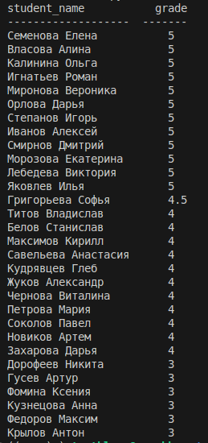

# workmate_test

Скрипт читает csv-файлы вида
```
    student_name,subject,teacher_name,date,grade
    Семенова Елена,Английский язык,Ковалева Анна,2023-10-10,5
    Титов Владислав,География,Орлов Сергей,2023-10-12,4
    Власова Алина,Биология,Ткаченко Наталья,2023-10-15,5

```
и строит отчет об успеваемости студентов.

### Запуск скрипта
Для запуска скрипта необходимо ваполнить команду вида:
```bash
    python main.py --files students1.csv --report student-performance
```
где `--files` перечень файлов по которым необходимо построить отчет, а `--report` название отчета.

Если не передать назваине отчета, по умолчанию будет использован `student-performance`.

```bash
    python main.py --files students1.csv
```


Если запустить скрипт без параметров. Будет произведен поиск файлов по маске `student.*csv` в текущей директории.
```bash
    python main.py
```

### Пример отчета


